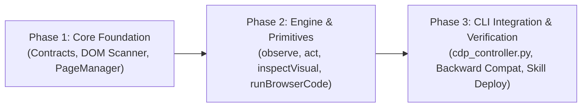

# OmniBrowser: Master Roadmap & Implementation Plan

## Phase Overview

---

## Phase 1: Core Foundation & Semantic Scanner
**Objective**: Build the foundational data contracts, in-browser DOM scanner, and CDP page lifecycle manager.

- [ ] **1.1 Data Contracts (`src/browser_core/contracts.py`)**:
  - Define `DOMNodeRef`, `ObserveResult`, `ActRequest`, `ActResult`, `StateDelta`.
  - Define standard exception taxonomy: `StaleRefError`, `TargetNotFoundError`, `ActionTimeoutError`.
- [ ] **1.2 Injected DOM Scanner (`scripts/dom_agent.js`)**:
  - Implement recursive/BFS candidate scanner with opaque ref scheme (`f0.d9.n186`).
  - Compute element interactivity, bounding boxes, text content, and ARIA roles.
  - Filter non-interactive containers, redundant SVG paths, and hidden elements.
- [ ] **1.3 Page & Connection Manager (`src/browser_core/page_manager.py`)**:
  - Robust CDP connection lifecycle with automatic reconnect.
  - Multi-target / iframe attachment support.
  - Epoch token generator to detect document navigation and invalidate stale refs.
- [ ] **1.4 Phase 1 Verification**:
  - Test suite with static HTML fixture (`tests/fixtures/test_page.html`).
  - Assert scanner produces valid JSON under 15KB with verifiable opaque refs.

---

## Phase 2: Engine & Action Primitives
**Objective**: Build the atomic action execution engine, postcondition verification, state delta calculator, and escalation primitives.

- [ ] **2.1 Core Action Engine (`src/browser_core/engine.py`)**:
  - Implement `observe(page, frame_id, compact=True)`.
  - Implement `act(page, action_type, ref, value, expectations)`.
  - Polling postcondition watchers (DOM mutation, URL change, network idle).
  - Return state deltas: what changed in the DOM as a result of the action.
  - Stale ref auto-recovery: fast re-scan if element moved.
- [ ] **2.2 Escalation Primitives (`src/browser_core/primitives.py`)**:
  - Implement `inspectVisual(page, ref_or_bbox, padding=20)`: targeted cropped screenshot.
  - Implement `runBrowserCode(page, code_snippet, args)`: sandboxed JS execution with return serialization.
- [ ] **2.3 Phase 2 Verification**:
  - Interactive integration tests on ephemeral Chrome instance.
  - Verify click, type, and form submit on test fixture.

---

## Phase 3: CLI Integration, Backward Compatibility & Skill Packaging
**Objective**: Update CLI controller, verify 100% backward compatibility, write documentation, and deploy to skill path.

- [ ] **3.1 Unified CLI Controller (`scripts/cdp_controller.py`)**:
  - Preserve legacy subcommands: `list-tabs`, `goto`, `eval`, `screenshot`.
  - Expose new subcommands: `observe`, `act`, `inspect-visual`, `run-code`.
  - Support `--json` output format for easy agent parsing.
- [ ] **3.2 Regression Suite (`tests/test_regression.py`)**:
  - Automated tests running legacy CLI commands against ephemeral Chrome.
  - Ensure zero regressions in existing workflows.
- [ ] **3.3 Skill Packaging & Deployment**:
  - Update `~/.gemini/config/skills/browser-automation-cdp/SKILL.md` with complete usage guide and examples.
  - Sync/symlink updated scripts to the active skill directory.
  - Final review and sign-off by `omni_reviewer`.
