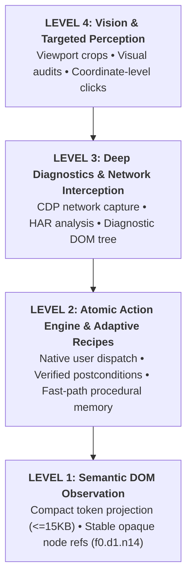
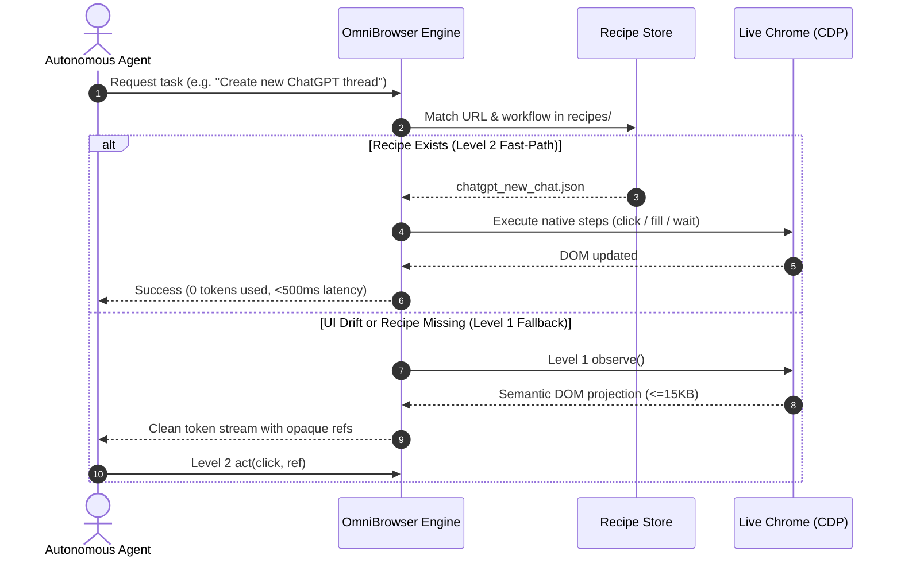

# OmniBrowser 🌐⚡

[](LICENSE)
[](pyproject.toml)
[](tests/)
[-orange.svg)](https://chromedevtools.github.io/devtools-protocol/)
[](SKILL.md)

**OmniBrowser** is a deterministic browser automation engine and procedural memory system engineered specifically for autonomous AI coding and research agents. Connecting directly to live Google Chrome instances over the Chrome DevTools Protocol (CDP), it provides zero anti-bot triggering, compact semantic DOM projections, verified atomic user actions, and self-healing procedural recipes.

---

## 🚀 Key Advantages Over Traditional Web Agents

| Problem with Traditional Tools | How OmniBrowser Solves It |
| :--- | :--- |
| **Cloudflare / Anti-Bot Detection** | Attaches directly to a live, authenticated Chrome profile (`~/.chrome-ai-profile`) over CDP. Never flags `navigator.webdriver`. |
| **Token Exhaustion (50k–200k DOM dumps)** | **Level 1 Semantic Projection**: compresses entire interactive page into $\le 15$ KB token stream with opaque, stable node refs (`f0.d1.n14`). |
| **Hallucinated / Flaky Clicks** | **Level 2 Atomic Action Engine**: native user event dispatch with strict pre- and postcondition assertion gates. |
| **High Latency & Token Waste on Recurring Tasks** | **Procedural Memory (Adaptive Recipes)**: executes parameterized JSON routines at native speed with zero LLM reasoning latency, falling back to Level 1 on UI drift. |
| **Complex LLM Web UI Automation** | Built-in **ChatGPT Web Client** supporting file attachments, streaming wait, native clipboard markdown extraction, and high-res image auto-downloading. |

---

## 🏛️ Progressive Capability Pyramid

OmniBrowser structures browser interactions into a deterministic 4-tier capability pyramid:





---

## 📦 Installation & Packaging

### Option 1: Install as an Antigravity / Gemini CLI Skill (Recommended)

To install or link OmniBrowser into your local AI agent skills directory (`~/.gemini/config/skills/omnibrowser`):

```bash
# Clone the repository
git clone https://github.com/huutrungle2001/OmniBrowser.git
cd OmniBrowser

# Symlink for live development (changes immediately active for agents)
./install.sh --symlink

# Or copy as a standalone snapshot
./install.sh --copy
```

### Option 2: Python Package (Standard Library)

Install OmniBrowser directly into your Python virtual environment:

```bash
pip install -e .
```

---

## 🛠️ Environment Setup

OmniBrowser attaches to Chrome running with remote debugging enabled. A dedicated helper script is included:

```bash
# Start Chrome on port 17082 with dedicated AI profile (~/.chrome-ai-profile)
./scripts/launch_chrome.sh
```

---

## 💻 CLI Usage Guide

The unified CLI `scripts/cdp_controller.py` provides complete control over browser tabs, observation, actions, and recipes:

### 1. Tab Management
```bash
# List all active tabs across windows
python3 scripts/cdp_controller.py list-tabs

# Navigate active or matched tab
python3 scripts/cdp_controller.py goto "https://github.com"

# Capture viewport screenshot
python3 scripts/cdp_controller.py screenshot --output /tmp/screenshot.png
```

### 2. Level 1: Semantic DOM Observation (`observe`)
```bash
# Get hierarchical semantic text projection
python3 scripts/cdp_controller.py observe

# Output structured JSON
python3 scripts/cdp_controller.py observe --json

# Limit element count for very dense single-page apps
python3 scripts/cdp_controller.py observe --max-elements 40
```

### 3. Level 2: Atomic Action Engine (`act`)
```bash
# Click an element by its opaque ref
python3 scripts/cdp_controller.py act click f0.d1.n14

# Fill text into an input or textarea ref
python3 scripts/cdp_controller.py act fill f0.d1.n8 "search query"

# Select an option in a dropdown
python3 scripts/cdp_controller.py act select f0.d1.n22 "OptionValue"
```

### 4. Level 2: Adaptive Recipes (`recipe`)
```bash
# List all available recipes
python3 scripts/cdp_controller.py recipe list

# View recipe details and steps
python3 scripts/cdp_controller.py recipe show chatgpt_new_chat

# Run recipe with parameter substitution
python3 scripts/cdp_controller.py recipe run chatgpt_ask_question --params '{"prompt": "Summarize today news"}'
```

### 5. Dedicated ChatGPT Web Client (`chatgpt_client.py`)
```bash
# Ask a question with file attachments and start fresh chat
python3 scripts/chatgpt_client.py chat "Analyze this module" -f src/browser_core/engine.py -n

# Check current logged-in account and workspace
python3 scripts/chatgpt_client.py account

# Extract latest markdown answer and save code block
python3 scripts/chatgpt_client.py extract --out /tmp/solution.py

# Download all generated DALL-E / generative images in high-res
python3 scripts/chatgpt_client.py download-images --out-dir .tmp/images/
```

---

## 🐍 Python Core API

```python
from browser_core.page_manager import PageManager
from browser_core.engine import observe, act
from browser_core.recipes import RecipeStore, RecipeEngine

# 1. Connect to live Chrome CDP
manager = PageManager("http://127.0.0.1:17082")
manager.connect()
page = manager.primary_page()

# 2. Level 1: Semantic Observation
projection = observe(page, manager=manager)
print(projection.to_markdown())

# 3. Level 2: Execute Atomic Action
act(page, "click", "f0.d1.n5", manager=manager)

# 4. Level 2: Procedural Memory Recipe
store = RecipeStore("recipes")
engine = RecipeEngine(store)
result = engine.execute("chatgpt_new_chat", page, manager=manager)

if not result.ok:
    # Automatic Level 1 fallback on UI drift
    print(f"Fallback triggered: {result.message}")
    fresh_projection = observe(page, manager=manager)
```

---

## 📖 Recipe Authoring Specification

Recipes are stored as clean JSON files inside `recipes/<domain>/<name>.json`:

```json
{
  "id": "chatgpt_ask_question",
  "name": "Submit prompt to ChatGPT",
  "description": "Fill prompt textarea and click the send button.",
  "domain_pattern": ["https://chatgpt.com/*"],
  "steps": [
    {
      "action": "fill",
      "target": "#prompt-textarea, div.ProseMirror",
      "value": "{{prompt}}"
    },
    {
      "action": "click",
      "target": "button[data-testid='send-button'], button[aria-label*='Send']"
    }
  ],
  "validation": {},
  "metadata": {
    "version": "1.0",
    "success_count": 0,
    "failure_count": 0,
    "last_failure_reason": null,
    "failure_ledger": []
  }
}
```

* **Templating**: Any `{{variable}}` string in `target`, `value`, or `expect` is dynamically substituted via `--params '{"variable": "value"}'`.
* **Actions**: Supports `click`, `fill`, `select`, `wait_for`, and `eval`.
* **Self-Healing & UI Drift**: If a target selector fails, the engine updates `last_failure_reason` and logs the event to `failure_ledger` before invoking Level 1 fallback.

---

## 🧪 Testing

OmniBrowser includes a comprehensive suite of unit and integration tests using ephemeral browser contexts:

```bash
PYTHONPATH=src python3 -m pytest tests/
```

Test coverage includes:
- Semantic DOM node reference stability and token compression.
- Atomic user event dispatch with postcondition gates.
- Network traffic capture and JSON response parsing.
- Procedural memory recipe matching, parameterization, and failure recovery.
- CLI subcommand argument parsing and exit code guarantees.

---

## 🔒 Security & Invariants

1. **Zero Profile Tampering in Automated Tests**: Test fixtures always launch ephemeral isolated browsers. User profile data (`~/.chrome-ai-profile`) is never modified by test runs.
2. **PII and Secret Masking**: The recipe distillation engine automatically sanitizes passwords, auth tokens, JWTs, and email addresses before persisting recipes.
3. **Deterministic Verification**: Every action must have an observable postcondition or exit code 0 confirmation.

---

## 📄 License

Apache License 2.0. See [LICENSE](LICENSE) for details.
